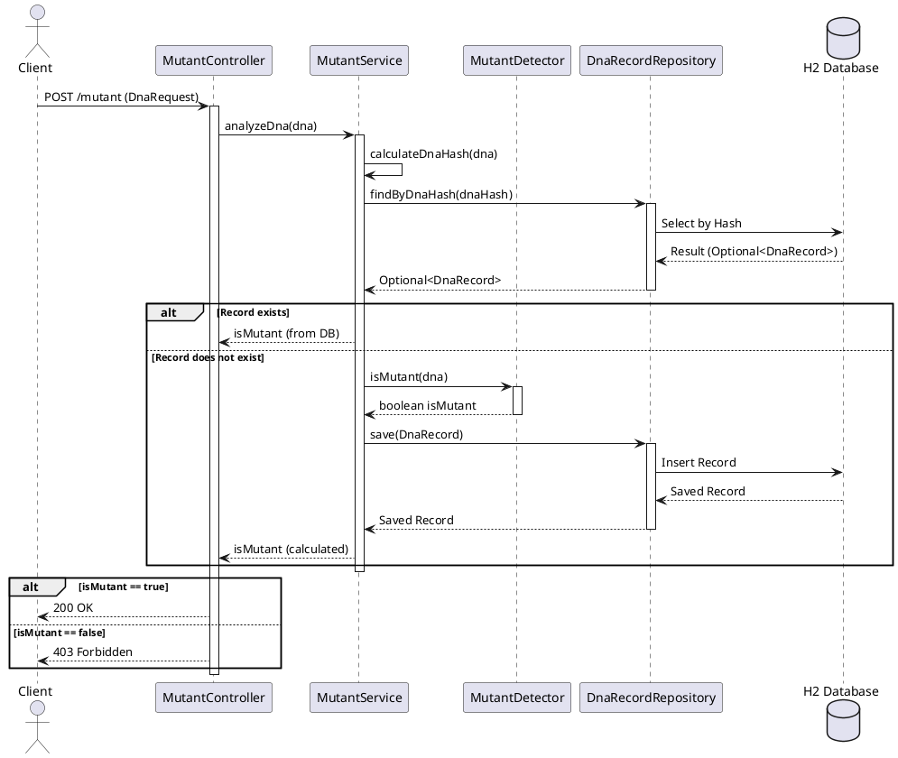
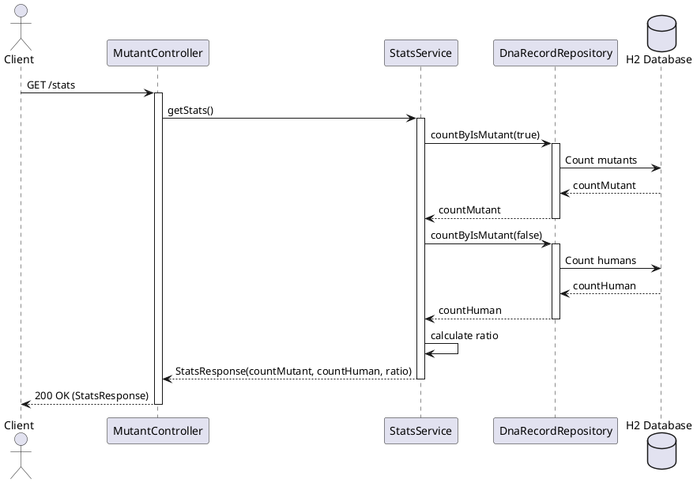

# Diagramas de Secuencia PlantUML

## POST /mutant

```plantuml
@startuml
actor Client
participant "MutantController" as Controller
participant "MutantService" as Service
participant "MutantDetector" as Detector
participant "DnaRecordRepository" as Repository
database "H2 Database" as DB

Client -> Controller: POST /mutant (DnaRequest)
activate Controller

Controller -> Service: analyzeDna(dna)
activate Service

Service -> Service: calculateDnaHash(dna)

Service -> Repository: findByDnaHash(dnaHash)
activate Repository
Repository -> DB: Select by Hash
DB --> Repository: Result (Optional<DnaRecord>)
Repository --> Service: Optional<DnaRecord>
deactivate Repository

alt Record exists
    Service --> Controller: isMutant (from DB)
else Record does not exist
    Service -> Detector: isMutant(dna)
    activate Detector
    Detector --> Service: boolean isMutant
    deactivate Detector

    Service -> Repository: save(DnaRecord)
    activate Repository
    Repository -> DB: Insert Record
    DB --> Repository: Saved Record
    Repository --> Service: Saved Record
    deactivate Repository

    Service --> Controller: isMutant (calculated)
end

deactivate Service

alt isMutant == true
    Controller --> Client: 200 OK
else isMutant == false
    Controller --> Client: 403 Forbidden
end

deactivate Controller
@enduml
```

## GET /stats

```plantuml
@startuml
actor Client
participant "MutantController" as Controller
participant "StatsService" as Service
participant "DnaRecordRepository" as Repository
database "H2 Database" as DB

Client -> Controller: GET /stats
activate Controller

Controller -> Service: getStats()
activate Service

Service -> Repository: countByIsMutant(true)
activate Repository
Repository -> DB: Count mutants
DB --> Repository: countMutant
Repository --> Service: countMutant
deactivate Repository

Service -> Repository: countByIsMutant(false)
activate Repository
Repository -> DB: Count humans
DB --> Repository: countHuman
Repository --> Service: countHuman
deactivate Repository

Service -> Service: calculate ratio

Service --> Controller: StatsResponse(countMutant, countHuman, ratio)
deactivate Service

Controller --> Client: 200 OK (StatsResponse)
deactivate Controller
@enduml
```
